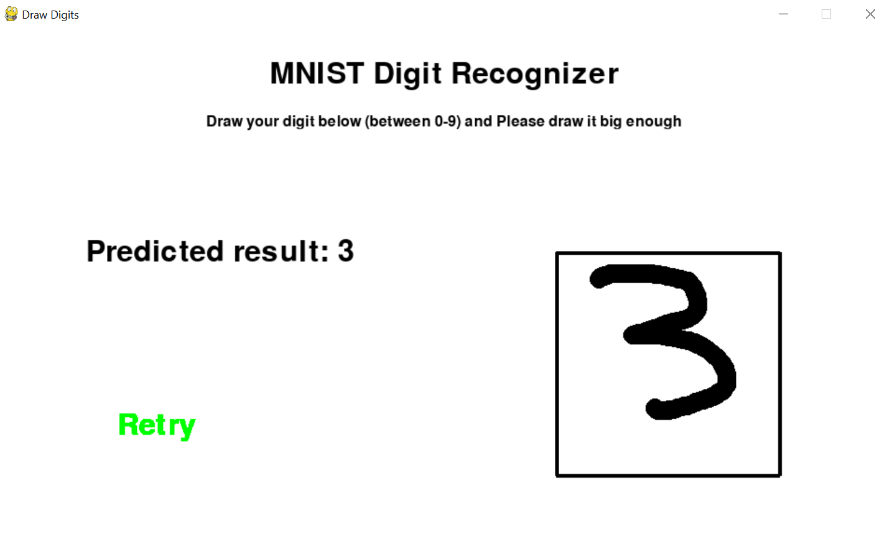

# draw-digits
Number Recognizer using mnist digit dataset

Im using pygame to draw the input then processed to the model

For the model, Im using CNN and load the dataset from keras then trained the model

How To Use :
- Install all libraries first (pip install -r requirements.txt)
- You can draw in right box then press SPACEBAR to get the result
- If you want to clear the box and try again, just press the "Retry" text

Image Demo:

